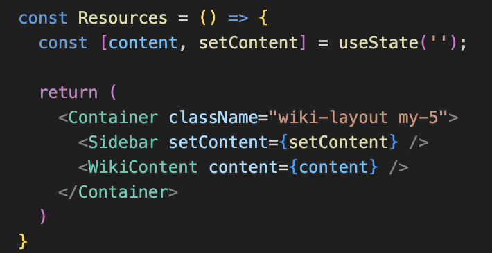
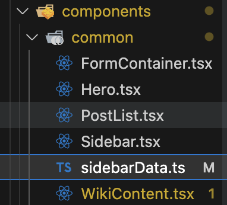
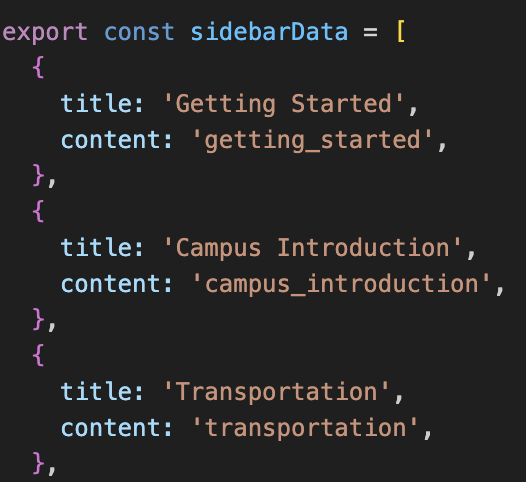
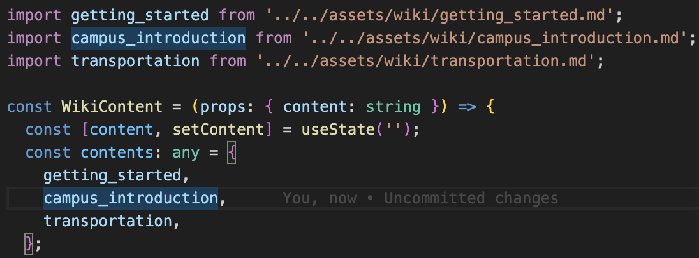

# How to Add Markdown Content and Render it on Front-End Pages

## Folder Structure

- The `Resources.tsx` page is integrated with `Sidebar.tsx` and `WikiContent.tsx` components. I simply utilized the `useState` hook to enable the sidebar to control the page content rendered in the wiki content component.

- Both the `Sidebar.tsx` and `WikiContent.tsx` components reside within `src/components/common/`. The sidebar menu is dynamically generated using the `sidebarData.ts` file.

- Inside the `WikiContent.tsx`, the markdown file is imported and organized as an array named `contents` for rendering. The `ReactMarkdown` module is employed to automatically convert the markdown content into html format.

- The static markdown files are located within `src/assets/wiki` folder. If you are unfamiliar with writing markdown docs, please refer to the cheat sheet for guidance.
    - *cheat sheet* : [Markdown Cheat Sheet | Markdown Guide](https://www.markdownguide.org/cheat-sheet/)
        

## Procedure

1. Begin by cloning the repository from https://github.com/hackersclubsv/hackersclub-frontend-django to your local machine.
2. Run `npm install` to install all the required modules. Use `npm start` to locally test the application.
3. Create your own branch by `git checkout -b your-own-branch` and and start working on your changes.
4. Create markdown file in `src/assets/wiki` folder.
5. Add the markdown file name and the corresponding title to be displayed in the sidebar. Follow the format: **`{ title: Sidebar Title, content: Markdown Filename without .md }`**.
6. In **`WikiContent.tsx`**, import the markdown file and include the filename within the **`contents`** array
7. Upon completing your work, commit and push your code changes to the GitHub repository using `git add`,`git commit`, and `git push`. Then, go to the GitHub repository to initiate a pull request. Kindly add me (`hellomomiji` or `hackersclubsv`) as a reviewer.

## Content Resources

- The doc I wrote for COE as COE student ambassador (a draft working in progress for your reference)
  - [San Jose Handbook Draft (WIP).docx](/tutorials/markdown/San%20Jose%20Handbook%20Draft%20(WIP).docx)
    
- https://siliconvalley.northeastern.edu/student-resources/new-students/
- https://siliconvalley.northeastern.edu/
- https://siliconvalley.northeastern.edu/wp-content/uploads/2022/07/New-Student-Guide-SF-Bay-Area-Fall-2022.pdf
- https://siliconvalley.northeastern.edu/wp-content/uploads/2022/08/Northeastern-University-in-San-Jose-Campus-Guide-2022-2023.pdf
